# SFS Super

The [Super Synthesis](https://github.com/supersynthesis/eurorack) Eurorack
library by Chris McDowell, ported to VCV Rack with his permission.

Each module wears its hardware panel, with the panel's own drawn jacks, knobs,
sliders and buttons as its controls. The digital modules run their firmware at
its own interrupt rates, with its tables, integer maths and quirks. The analog
modules are modelled stage by stage from their schematics, component values
included, so ranges and curves come from the circuit.

Download a build for your platform from
[Releases](https://github.com/stuart78/sfs-super-vcv/releases), put the
`.vcvplugin` in Rack's plugins folder and restart Rack. A
[nightly build](https://github.com/stuart78/sfs-super-vcv/releases/tag/nightly)
tracks `main`; it installs as a separate plugin, SFS Super (Nightly).

## Contents

- [2OPFM](#2opfm): two-operator FM voice with six firmwares
- [PHRSR](#phrsr): phrase recorder
- [SVFs](#svfs): dual state-variable filter
- [EG](#eg): attack/decay envelope
- [VCAs](#vcas): quad linear VCA and mixer
- [SCANNER](#scanner): CV crossfader
- [TVCA](#tvca): distorting VCA
- [CHORUS](#chorus): chorus and delay
- [ROOM](#room): reverb
- [OTAVCAs](#otavcas): dual OTA VCA (unreleased design)
- [S&H](#sh): triple sample and hold (unreleased design)
- [PNGBL](#pngbl): pingable filter (unreleased design)

## 2OPFM

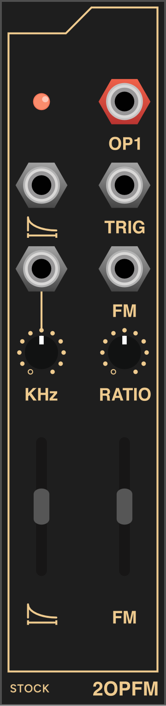

A two-operator FM voice. The context menu picks the firmware:

- **Stock**: the shipped firmware, emulated at its own 39.975 kHz interrupt
  with its envelope tick, tables and sample-and-hold DAC.
- **2OPFM+**: the same instrument done carefully: calibrated V/OCT, RATIO
  sticky on the integers, and modulator feedback in the top quarter of FM.
- **Modal drum**: a struck membrane, modelled mode by mode, morphing to a bar.
- **CZ**: Casio-style phase distortion; FM is the DCW.
- **Formant**: a FOF formant voice; RATIO is the vowel.
- **Bell**: a 17-partial bell, morphing to a bar.

The tooltips rename the controls to match the firmware in use. The five
alternative firmwares also run on the hardware module.

 

## PHRSR

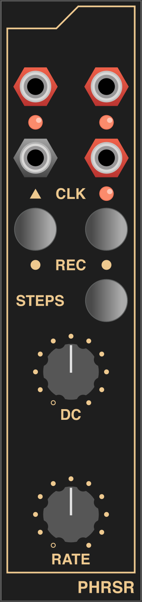

Two 16-step phrases, recorded live from the DC knob and replayed on a clock.
The firmware is transcribed with its integer types and run at the chip's
1422 Hz, quirks included. On the hardware you hold REC while turning DC; a mouse
cannot hold one control while moving another, so here the buttons latch and
light while they are on. Sequences are saved with the patch.

 

## SVFs

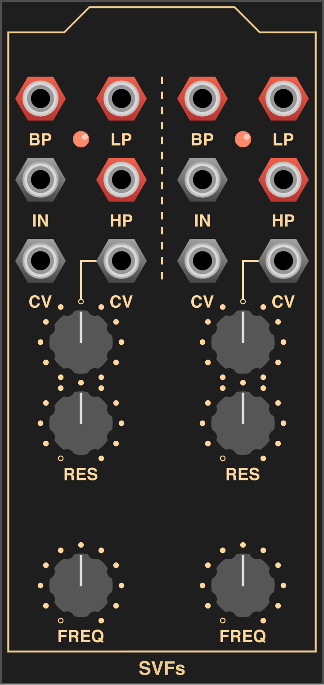

Two 2164 state-variable filters with low-, band- and high-pass outputs. FREQ is
exactly 1V/oct and sweeps nearly twenty octaves. Full RES self-oscillates, held
to about 11 Vpp by back-to-back zeners, except at the very top of its travel,
where the rails limit it instead, as on the circuit.

 

## EG

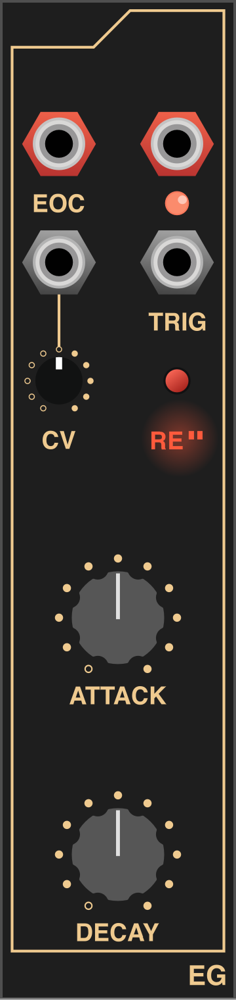

A fast analog attack/decay envelope on an LM13700. A trigger starts the attack,
which turns to decay as the envelope crosses about 6 V. RE switches between
one-shot and re-trigger and lights the panel's red window. EOC fires as the
envelope falls to zero. ATTACK carries an offset in the circuit, so its range
leans slow.

 

## VCAs

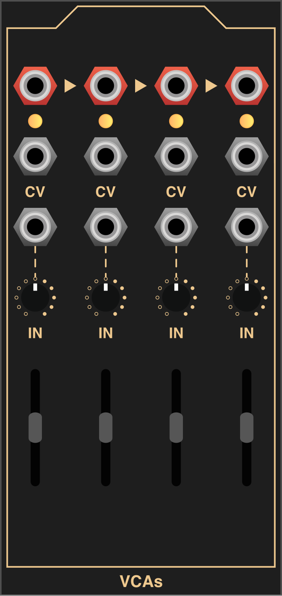

Four linear 2164 VCAs. Each input has an attenuverter, each gain a slider plus
CV. An unpatched output sums into the next channel, so the four chain into a
mixer from left to right.

 

## SCANNER

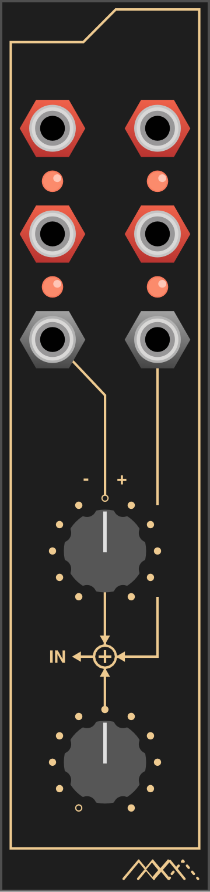

The control half of a four-way crossfader: one scan voltage, from the knob and
two CV inputs, drives four overlapping triangular windows of about 7 V. Patch
the outputs to VCAs to scan between four signals.

 

## TVCA

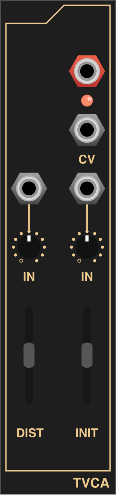

Two inputs summed into an LM13700 VCA with tanh saturation. DIST sets how hard
the OTA is driven; INIT sets the gain, and CV adds to it.

 

## CHORUS

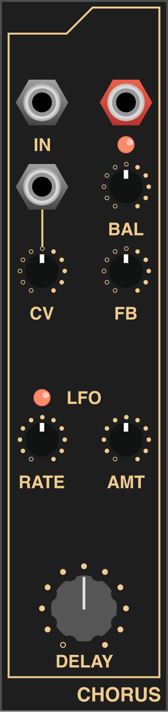

A modulated delay line, from chorus to a 300 ms echo, with inverted feedback,
ported from its firmware at the firmware's own 49.95 kHz. BAL crossfades dry and
wet; the CV input moves the delay through its attenuverter. The panel is rebuilt
from the PCB gerbers.

 

## ROOM

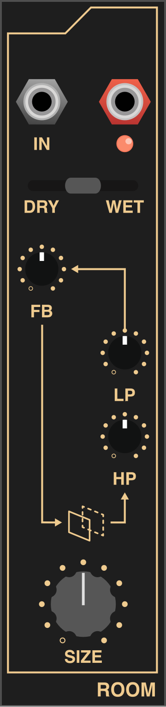

An allpass reverb, ported from its firmware: seven allpasses in one shared
buffer, a filtered loop and inverted feedback. The firmware's lookup table is
short, so LP at the very top of its travel silences the wet signal; that is kept,
and the context menu can complete the table. FB near the top is the firmware's
own too: grit from about 0.9, a near-infinite hold at 0.98, and a runaway at the
very top.

 

## OTAVCAs

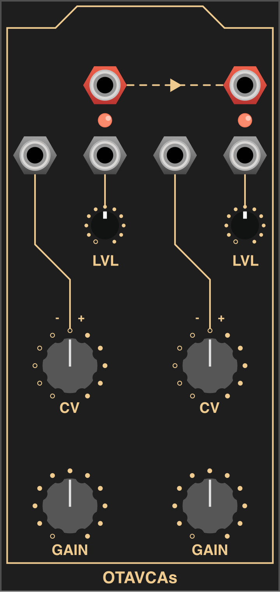

An unreleased Super Synthesis design: two LM13700 VCAs that saturate readily,
with a level control on each input and an attenuverted CV. Output 1, unpatched,
sums into output 2.

 

## S&H

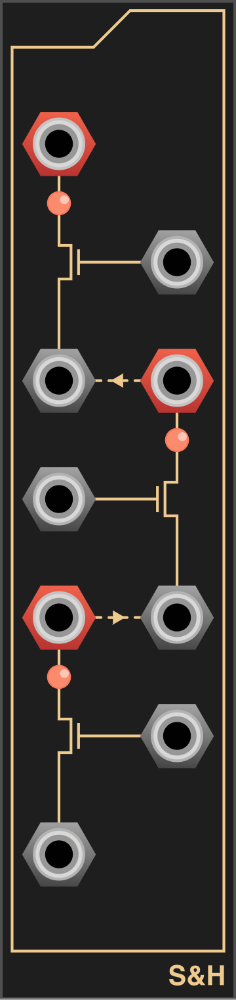

An unreleased Super Synthesis design: three JFET sample-and-holds, drawn as a
chain running upwards. Each input is normalled from the channel below's output,
and each trigger from the channel below's trigger, inverted: one trigger samples
the first channel on its rise, the second on its fall, and the third just after.

 

## PNGBL

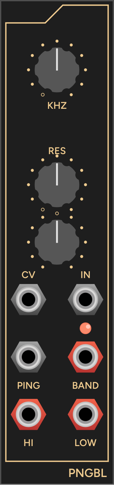

An unreleased Super Synthesis design: an OTA state-variable filter with a PING
input that kicks it into ringing. The design has no panel art, so this panel is
provisional.

 

## Where the port assumes

CHORUS and ROOM have no published schematic, so their audio input and output are
taken to be a Eurorack effect's: ±10 V full scale, unity gain. EG's converter
reference current assumes matched transistors. SCANNER's outputs are numbered in
reading order, since the schematic does not name the jacks.

## Licence

The port's code is GPL-3.0-or-later (see [LICENSE](LICENSE)). The original
designs, firmware and panel art are Super Synthesis's, released under CC0; see
[NOTICE.md](NOTICE.md).
